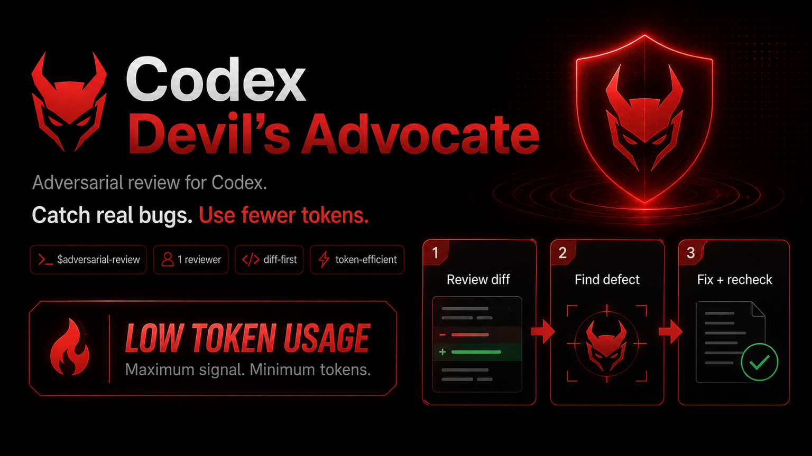

# Codex Devil's Advocate

<p align="center">
  
</p>

<p align="center">
  <strong>A token-efficient adversarial review skill for Codex.</strong><br/>
  It does not try to approve your code — it tries to <em>break</em> it.
</p>

<p align="center">
  
  
  
  
  
  
</p>

<p align="center">
  
  
  
  
</p>

<p align="center">
  <a href="#the-idea"></a>
  <a href="#installation"></a>
  <a href="#usage"></a>
  <a href="#token-efficiency-by-design"></a>
</p>

---

## Stop asking your coding agent if the code is correct.

Ask another agent to prove that it is **wrong**.

Most AI review workflows fail in one of two directions: they are too shallow to catch subtle bugs, or they burn huge amounts of context and tokens by launching multiple reviewers and repeatedly rescanning the repository.

**Codex Devil's Advocate** takes a different approach.

> One strong adversarial reviewer. One full pass. Up to two focused rechecks. Only evidence-backed defects keep the loop alive.

The result is a review workflow designed around **maximum defect-finding value per token spent**.

---

## The idea

After Codex finishes a task, invoke:

```text
$adversarial-review
```

The skill then runs a bounded adversarial loop:

```text
IMPLEMENT
   ↓
CHEAP TESTS / BUILD / TYPECHECK
   ↓
FREEZE REVIEW SCOPE
   ↓
DIFF-FIRST CONTEXT SELECTION
   ↓
ONE READ-ONLY ADVERSARIAL REVIEWER
   ↓
MAIN CODEX VERIFIES FINDINGS
   ↓
CONFIRMED BLOCKING DEFECTS?
   ├── NO  → PASS
   └── YES
        ↓
       FIX
        ↓
   REGRESSION TESTS
        ↓
 SAME REVIEWER THREAD
 TARGETED RECHECK
        ↓
   MAYBE FIX AGAIN
        ↓
   TARGETED RECHECK #2
        ↓
       STOP
```

No reviewer swarm. No endless recursive review loop. No full repository reread after every fix.

---

## Why this is different

| Feature | What it means |
|---|---|
| **1 reviewer only** | Avoids overlapping subagents and duplicated findings |
| **Read-only reviewer** | The critic cannot mutate or quietly “fix” the code it is judging |
| **Diff-first** | Starts from the actual change instead of ingesting the whole repository |
| **Evidence-first** | Findings need a concrete trigger, execution path, and incorrect result |
| **Main-agent verification** | Reviewer findings are not blindly trusted |
| **Bounded re-review** | One full review + at most two incremental rechecks |
| **Global installation** | Install once and use in every Codex project |
| **Explicit-only invocation** | It does not consume review budget unless you ask for it |

---

## What the reviewer looks for

The reviewer attempts to falsify the implementation by searching for concrete failures involving:

- logic errors
- violated invariants
- invalid state transitions
- boundary conditions
- stale or partially initialized state
- regressions
- incorrect assumptions
- error and failure paths
- tests that pass without proving correctness
- concurrency problems when relevant
- security problems when relevant

It is specifically told **not** to manufacture criticism just to look useful.

A good finding should look like:

```text
trigger / state
→ reachable execution path
→ violated contract or invariant
→ observable incorrect result
```

If that chain cannot be established, the issue should not be treated as a confirmed defect.

---

## Token-efficiency by design

The hard default budget is:

```text
Full adversarial reviews: 1
Incremental re-reviews: up to 2
Concurrent reviewer subagents: 1
```

### What this avoids

A naive adversarial workflow often becomes:

```text
Reviewer A reads repository
→ fix
Reviewer B reads repository again
→ fix
Reviewer C reads repository again
→ final reviewer reads repository again
```

That may improve review diversity, but it is expensive.

Devil's Advocate instead reuses the reviewer's existing mental model:

```text
full review
→ fix
→ inspect only the new patch + related paths
→ fix if needed
→ one last targeted check
```

This keeps the expensive repository-understanding step bounded.

---

## Frozen scope

At the beginning of a review, the skill establishes one review target and keeps it stable.

The target is selected from, in order:

1. scope explicitly named by the user
2. implementation completed in the current task
3. current staged/unstaged diff
4. branch comparison when it can be determined reliably

This prevents the reviewer from wandering into unrelated legacy code and spending tokens finding bugs that have nothing to do with the change you just made.

---

## Context minimization

The reviewer starts with:

```text
changed files
+ changed symbols
+ relevant tests
```

It expands outward only when needed to understand or prove a defect:

```text
callers
callees
interfaces
contracts
state transitions
persistence boundaries
schemas
API boundaries
related regression-sensitive behavior
```

Generated files, lockfiles, vendor code, huge fixtures, and unrelated modules are skipped unless behaviorally relevant.

---

## False-positive filtering

Adversarial does **not** mean paranoid.

The reviewer tries to disprove its own suspicions before reporting them. Then the main Codex agent independently checks every returned finding and classifies it as:

```text
CONFIRMED
REJECTED
UNCERTAIN
```

Only confirmed defects should normally lead to code changes.

This matters because an AI critic can be confidently wrong too.

---

## Stop condition

The goal is **not**:

```text
zero criticism
```

The goal is:

```text
zero confirmed blocking correctness defects
```

Blocking severity levels are:

- `CRITICAL`
- `HIGH`
- `MEDIUM`

The workflow does not keep consuming tokens because of style preferences, theoretical concerns, or minor LOW-severity issues.

---

# Installation

## Global install — recommended

Install once and use the skill in every Codex project.

### Windows

Clone or download this repository, open PowerShell in the repository root, then run:

```powershell
powershell -ExecutionPolicy Bypass -File .\install.ps1
```

The installer copies the skill to:

```text
%USERPROFILE%\.agents\skills\adversarial-review\
```

and the custom reviewer to:

```text
%USERPROFILE%\.codex\agents\adversarial-reviewer.toml
```

### macOS / Linux

```bash
chmod +x install.sh
./install.sh
```

The files are installed into:

```text
~/.agents/skills/adversarial-review/
~/.codex/agents/adversarial-reviewer.toml
```

Restart Codex if the skill was not detected immediately.

---

## Uninstall

### Windows

```powershell
powershell -ExecutionPolicy Bypass -File .\uninstall.ps1
```

### macOS / Linux

```bash
chmod +x uninstall.sh
./uninstall.sh
```

---

# Usage

## The simplest workflow

First let Codex implement your task normally.

Then run:

```text
$adversarial-review
```

That is it.

---

## Run it automatically after a task

You can also include it in the task itself:

```text
Implement the new inventory system.
Run the relevant tests.
Then run $adversarial-review.
```

Or:

```text
Refactor the betting state machine and use $adversarial-review after the implementation is complete.
```

---

## When you should use it

Good candidates:

- non-trivial feature implementation
- bug fixes involving state or business logic
- state machines
- persistence code
- financial or numerical logic
- async workflows
- concurrency-sensitive changes
- authentication / authorization logic
- large refactors
- behavior where tests alone may create false confidence

Usually unnecessary for:

- comments
- formatting
- copy changes
- trivial renames
- tiny cosmetic UI adjustments

The skill is explicit-only specifically so you decide when deeper review is worth the budget.

---

# Example

You ask Codex:

```text
Implement inventory stacking.
```

Codex implements it and tests pass.

Then:

```text
$adversarial-review
```

The reviewer may return:

```text
HIGH — partial stack merge can destroy quantity

Trigger:
Target stack has less free capacity than the incoming quantity.

Execution path:
mergeItem()
→ target quantity reaches max
→ source slot is cleared unconditionally

Actual:
Remaining source quantity is lost.

Expected:
Only the transferred amount should leave the source stack.
```

The main Codex agent verifies the path, confirms the bug, fixes it, and adds a regression test.

The same reviewer receives only the resulting patch and checks whether:

- the original failure is actually fixed
- the fix created a nearby regression
- the regression test proves the behavior

If no blocking defect remains:

```text
Adversarial review: PASS

- Full reviews: 1
- Incremental re-reviews: 1/2
- Confirmed: Critical 0 / High 1 / Medium 0
- Fixed: 1
- Rejected false positives: 1
- Validation: targeted tests, build
- Remaining blocking defects: none
```

---

# Architecture

```text
User
 │
 ▼
Main Codex Agent
 │
 ├── implements feature
 ├── runs deterministic checks
 └── invokes skill
        │
        ▼
  adversarial_reviewer
        │
        ├── read-only
        ├── diff-first
        ├── reconstructs contracts
        ├── hunts counterexamples
        └── returns evidence
        │
        ▼
Main Codex Agent
 │
 ├── verifies each finding
 ├── rejects false positives
 ├── fixes confirmed defects
 └── adds regression tests
        │
        ▼
Same reviewer thread
 │
 └── targeted incremental recheck
        │
        ▼
      PASS / FAIL
```

---

# Repository layout

```text
.agents/
└── skills/
    └── adversarial-review/
        ├── SKILL.md
        └── agents/
            └── openai.yaml

.codex/
└── agents/
    └── adversarial-reviewer.toml

install.ps1
install.sh
uninstall.ps1
uninstall.sh
```

### `SKILL.md`

Controls the review workflow, budget, scope selection, verification loop, fix loop, and stop condition.

### `adversarial-reviewer.toml`

Defines the independent read-only reviewer and its adversarial review behavior.

### `openai.yaml`

Contains Codex skill metadata and keeps the skill explicitly invoked rather than automatically triggered.

---

# Why not just ask Codex to review its own code?

Because the agent that designed and implemented a solution already carries the assumptions that led to that solution.

A separate adversarial reviewer gets a different objective:

```text
Implementer:
"Make this work."

Reviewer:
"Find a concrete case proving this does not work."
```

That shift in objective is the core of adversarial review.

---

# Why not use three or five reviewers?

You can — but this project intentionally does not.

Multiple reviewers can improve diversity, but they also multiply:

- repository reads
- duplicated reasoning
- duplicated findings
- context usage
- token consumption

Devil's Advocate is designed as a **daily-driver review skill**, not a maximum-cost formal verification system.

For most development work, one strong reviewer with good falsification instructions and a bounded repair loop is a better practical tradeoff.

---

# Does this replace tests?

No.

The intended workflow is:

```text
implementation
→ deterministic tests
→ adversarial reasoning
→ repair
→ regression tests
→ targeted recheck
```

Tests and adversarial review catch different classes of failure.

---

# Does it guarantee bug-free software?

No — and it deliberately never claims to.

The final success statement is:

> **No confirmed blocking defects remain in the reviewed scope.**

That is much more defensible than claiming an implementation is perfect.

---

# Philosophy

A useful AI reviewer should not be rewarded for producing a long list of criticism.

It should be rewarded for finding a **small number of defects that survive scrutiny**.

```text
Suspicion
   ↓
Is the state reachable?
   ↓
Can the execution path be traced?
   ↓
Does incorrect observable behavior result?
   ↓
Can the finding survive an independent check?
   ↓
CONFIRMED DEFECT
```

One subtle real bug is worth more than twenty generic observations.

---

## Quick start

```text
1. Clone/download this repository
2. Run install.ps1 or install.sh
3. Restart Codex if needed
4. Open any code project
5. Finish a non-trivial implementation
6. Run $adversarial-review
7. Let Codex verify and repair confirmed findings
```

---

<p align="center">
  <strong>Your coding agent writes the solution.<br/>Devil's Advocate tries to prove it wrong.</strong>
</p>

<p align="center">
  <code>$adversarial-review</code>
</p>